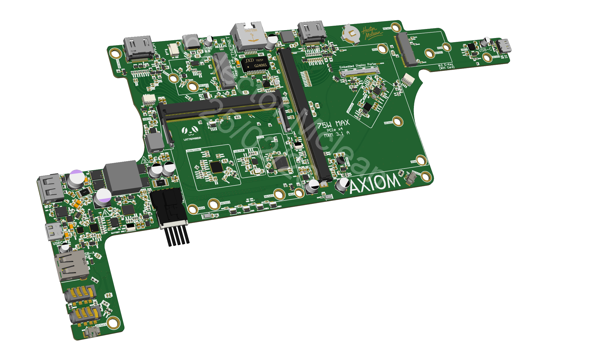

# AXIOM_LAPTOP
Open source laptop design, based off of the Lattepanda Mu, and an MXM formfactor GPU. 14", 2.5K@90Hz OLED Display from Samsung. Features USB-C PD @ 180W (240W hardware capable, WIP)

## License
This project is open-source and is released under multiple licenses depending on the component:

* **Hardware (Schematics, PCBs, Gerbers):** Licensed under the CERN Open Hardware Licence Version 2 - Strongly Reciprocal ([CERN-OHL-S-2.0](LICENSE-HARDWARE)).
* **Firmware/Software:** Licensed under the GNU General Public License v3.0 ([GPL-3.0](LICENSE-FIRMWARE)).
* **Documentation (Images, PDFs, Text):** Licensed under Creative Commons Attribution-ShareAlike 4.0 International ([CC-BY-SA-4.0](LICENSE-DOCS)).
